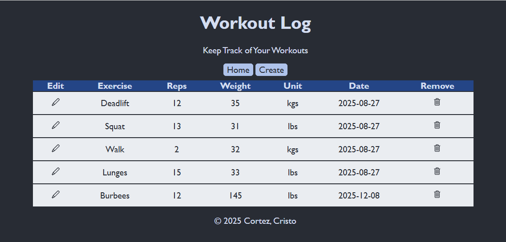
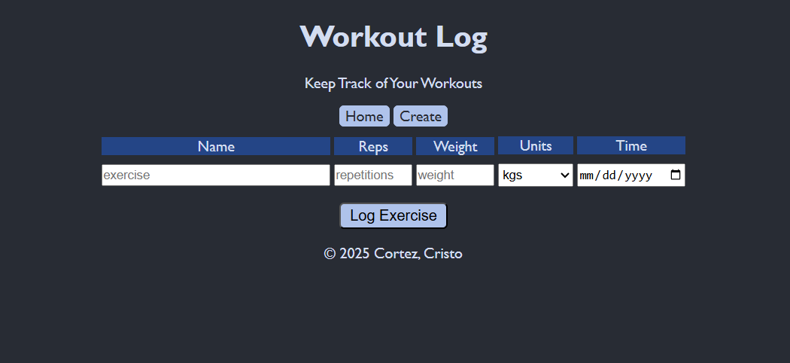
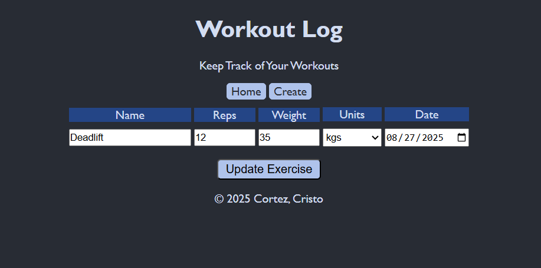

# Exercise Tracker

A full-stack MERN (MongoDB, Express, React, Node.js) single-page application for tracking workout exercises.

## Features

- **Add exercises** with name, reps, weight, unit, and date
- **Edit existing exercises** to update workout details
- **Delete exercises** from your log
- **View all exercises** in an organized table format
- Full CRUD functionality with a responsive user interface

## Screenshots

### Main View


### Add Exercise


### Update Exercise


## Technologies Used

**Frontend:**
- React
- Vite
- HTML/CSS
- JavaScript

**Backend:**
- Node.js
- Express.js
- MongoDB
- Mongoose

## Prerequisites

Before running this application, make sure you have the following installed:
- [Node.js](https://nodejs.org/) (v14 or higher)
- [MongoDB](https://www.mongodb.com/) - either:
  - MongoDB installed locally, OR
  - A free [MongoDB Atlas](https://www.mongodb.com/cloud/atlas) cluster
- npm (comes with Node.js)

## Installation

1. **Clone the repository**
   ```bash
   git clone https://github.com/ccortez8021/exercise-tracker.git
   cd exercise-tracker
   ```

2. **Install backend dependencies**
   ```bash
   cd backend-rest
   npm install
   ```

3. **Install frontend dependencies**
   ```bash
   cd ../frontend-rest
   npm install
   ```

4. **Set up environment variables**
   
   Copy the `.env.example` file to `.env` in the `backend` folder:
   ```bash
   cd backend-rest
   cp .env.example .env
   ```
   
   Then edit `.env` with your actual MongoDB connection string:
   ```
   MONGODB_CONNECT_STRING=your_mongodb_connection_string_here
   PORT=5000
   ```
   
   **To get your MongoDB URI:**
   - **Local MongoDB:** `mongodb://localhost:27017/exercise-tracker`
   - **MongoDB Atlas:** Get your connection string from your Atlas dashboard

## Running the Application

1. **Start the backend server**
   ```bash
   cd backend-rest
   npm start
   ```
   The server will run on `http://localhost:3000`

2. **Start the frontend** (in a new terminal)
   ```bash
   cd frontend-rest
   npm run dev
   ```
   The app will open in your browser at `http://localhost:5173` (or the port Vite assigns)

## Project Structure

```
exercise-tracker/
├── backend/
│   ├── models/          # MongoDB schemas
│   ├── controllers/     # Route handlers
├── frontend/
│   ├── src/
│   │   ├── components/  # React components
│   │   ├── App.js       # Main app component
│   │   └── index.js     # Entry point
│   └── public/
└── README.md
```

## API Endpoints

- `GET /exercises` - Retrieve all exercises
- `POST /exercises` - Create a new exercise
- `PUT /exercises/:id` - Update an existing exercise
- `DELETE /exercises/:id` - Delete an exercise

## Future Enhancements

- User authentication and authorization
- Exercise analytics and progress tracking
- Export workout data to CSV
- Mobile app version

## Author

Created by Cristo Cortez as part of a web development course final project.

## License

This project is open source and available under the [MIT License](LICENSE).
Last update: December 2025